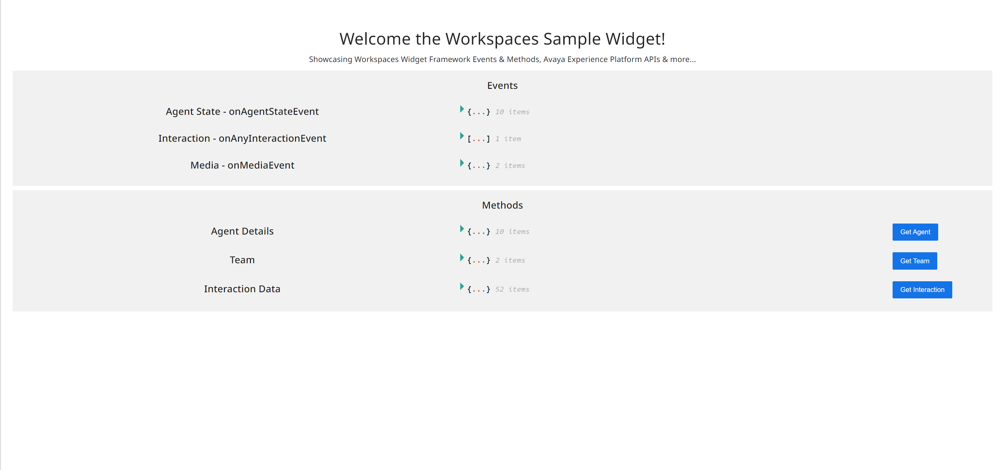

# Getting Started with Workspaces Widgets in React

This widget is a boiler-plate for Avaya Workspaces Widgets that can be used to build your widget from.
It also showcases functionalities & capabilities from the Workspaces Widget Framework SDK, as well as Avaya Experience Platform APIs.

    This widget is meant to be used only within Avaya Experience Platform.

---

## :warning: **Disclaimer**

> :bulb: this sample application is provided **for demonstration purposes only** and are not intended for production use. We assume no responsibility for any issues arising from its use.

---

## Current Capabilities
### Workspaces Widget Framework SDK

##### Events
- ```onAgentStateEvent``` - to subscribe to change in Agent's state (logged in, ready, not ready, etc..).
- ```onAnyInteractionEvent``` - to subscribe to any new Interaction that lands on the agent's desktop.
- ```onMediaEvent``` - to subscribe to Chat, SMS, Messaging, Email or Social related data such as participants or previously sent media messages.

##### Methods
- ```getConfiguration().user``` - to get the full logged in Agent configuration.
- ```getTeamData()``` - to get the Agent's team data (colleagues & supervisors).
- ```getInteractionData()``` - to get the current interaction's details.

For more events & methods, visit the [documentation](https://documentation.workspaces.avayacloud.com/widget-framework/docs/api-reference/introduction).
### TODO: AXP APIs

## Technology
The widget is build using React, Redux and Web-pack.

### Folder Structure

``` js
├── build // Build output folder
├──src
    ├── app
    │    ├── config.js // Configuration file
    │    └── store.js // Combined Store
    ├── assets // Static Assets (Images, Files, etc..)
    │   └── images 
    ├── features 
    │   └── sample-content // Sample Component
    │       ├── SampleContent.js // React Component 
    │       ├── SampleContent.module.css // Styling
    │       ├── sampleContentAPI.js // API Client Calls
    │       ├── sampleContentSlice.js // State Manager
    │       └── sampleContentSlice.spec.js //TestFile
    ├── services
        └── Auth.js // Authorization Service
    └── shared-components // Shared React Components 
├── secrets // Includes SSL certificates
├── server.conf
├── sample-widget.json // Widget JSON file to import to WS
└── webpack.config.js //Webpack configration
```

To create your own feature, copy the same format as the `sample-component` folder, add your required Components/API Calls/WS Widget SDK Calls.

Make sure to update `store.js` with you new component reducer.

## Build & Develop
After you make the changes as required by the widget you want to build, you can build and deploy your widget following the below steps

### Prerequisites
- `Node.js` version 18+ is required.
- `Yarn`
- `Docker` & `Docker Compose` (optional).
- SSL Certificate & Key to serve the built files.
- Upload the `sampel-widget.json` file into the `Avaya Experience Platform` Admin Portal and Widget Management.

---
### If you chose docker
1. Update the `docker-compose-dev.yml` file with the location of the SSL certificates.
2. ```sh
    yarn install
    npm run build
    docker-compose -f docker-compose-dev.yml up # add -d to run in a background process
    ```
3. After a change, just run ```npm run build``` and refresh your workspaces, all done!
---
### If you didn't choose docker.
1.  ```sh
    yarn install
    npm run build
    ```
2. Manually serve the contents of the `build/` (mainly `bundle.js`) folder using your favorite web-server (NGINX, TomCat, IIS, etc..)
3. Done
---

If you've done everything correctly, It should look something like this.



---

    Contributions are welcome!


